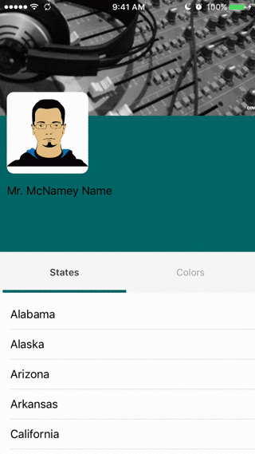

# StickyHeaderTabController

[](https://travis-ci.org/bchrobot/StickyHeaderTabController)
[](http://cocoapods.org/pods/StickyHeaderTabController)
[](http://cocoapods.org/pods/StickyHeaderTabController)
[](http://cocoapods.org/pods/StickyHeaderTabController)

Twitter profile-inspired tabbed content controller with sticky header and hero.



## Example

To run the example project, clone the repo, and run `pod install` from the Example directory first.

## Requirements

## Installation

StickyHeaderTabController is available through [CocoaPods](http://cocoapods.org). To install
it, simply add the following line to your Podfile:

```ruby
pod 'StickyHeaderTabController'
```

## Usage

To get started just subclass `StickyHeaderTabController` and add a header! See the [example project] for more details.

```swift
class ExampleTabController: StickyHeaderTabController {

    private let exampleHeader = ExampleStickyHeaderView()
    private let exampleHero = ExampleStickyHeroView()
    private let exampleTabBar = ExampleTabBar(frame: .zero) // optional customization

    override func viewDidLoad() {
        super.viewDidLoad()

        delegate = self

        stickyHeader = exampleHeader
        hero = exampleHero
        tabBar = exampleTabBar
        tabs = [StatesTabViewController(), ColorsTabViewController()]
    }

    fileprivate func updateAvatarFrame() {
        // Recalculate the avatar's frame based on scroll position
    }

    fileprivate func updateNameLabel() {
        // Recalculate name label's position based on scroll position
    }

}

extension ExampleTabController: StickyHeaderTabControllerDelegate {
    func stickyHeaderTabControllerDidScrollVertically(_ controller: StickyHeaderTabController) {
        // Perform any frame updates based on changes to contentOffset
        updateAvatarFrame()
        updateNameLabel()
    }
}
```

### StickyHeaderView
- width is set by `StickyHeaderTabController`
- height should be set by you
    - must not have priority >= 700 in order for stretch on vertical bounce to work.
    - be careful of compression resistance of subviews, especially imageviews.

### StickyHeroView
- width is set by `StickyHeaderTabController`
- height should be set by you
    - must not have any priorities lower than 250.

## Author

Benjamin Chrobot, benjamin.chrobot@alum.mit.edu

## License

StickyHeaderTabController is available under the MIT license. See the LICENSE file for more info.

[example project]: https://github.com/bchrobot/StickyHeaderTabController/tree/master/Example/StickyHeaderTabController

